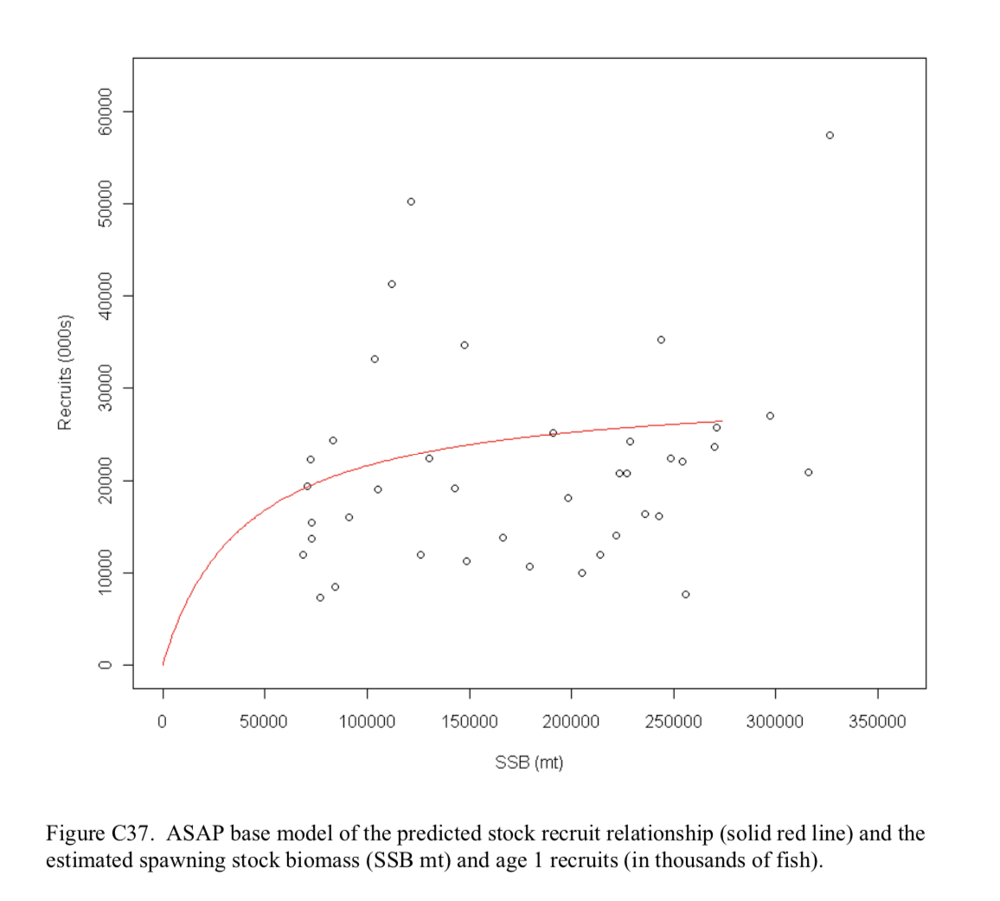
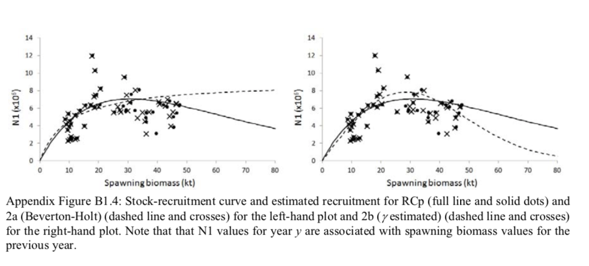
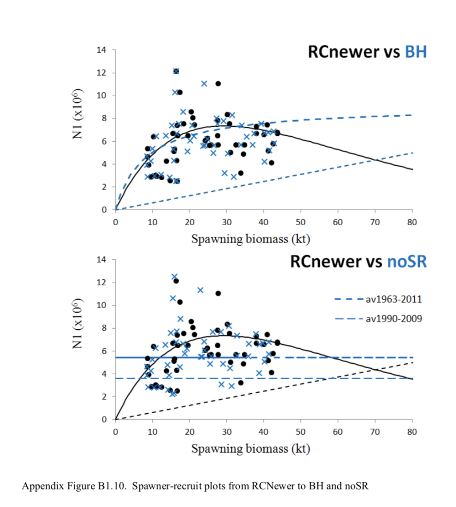
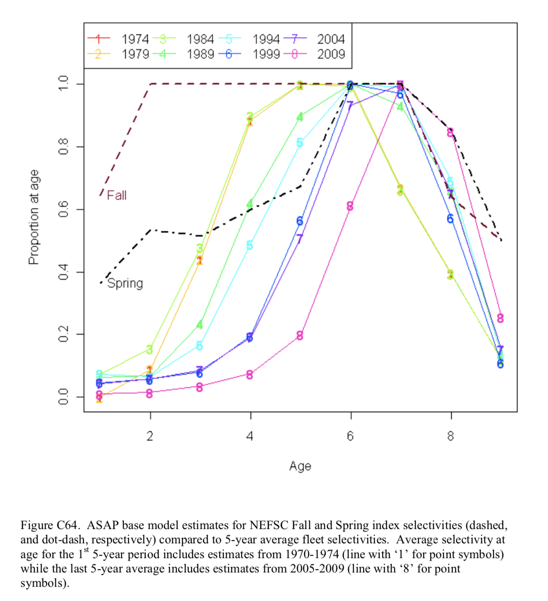
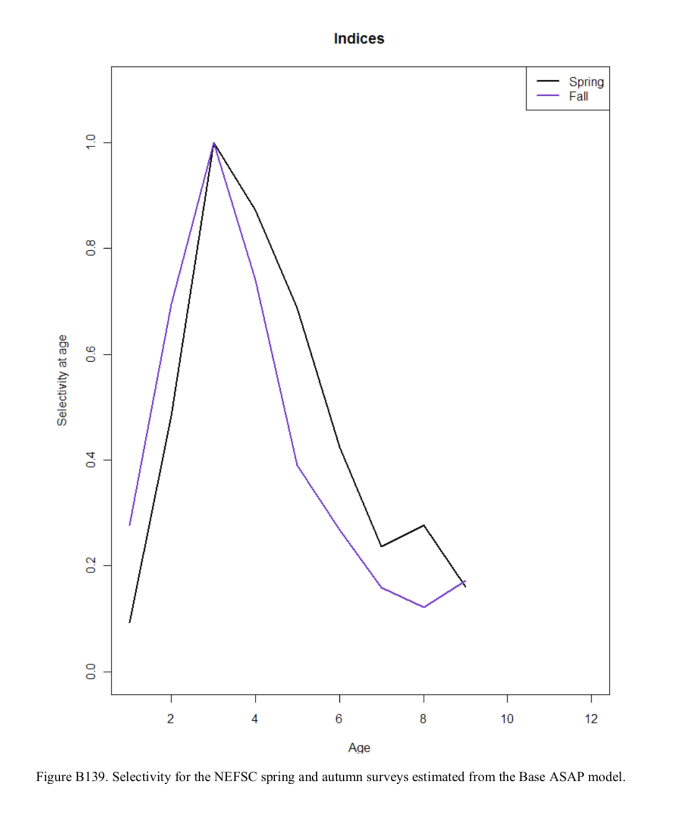
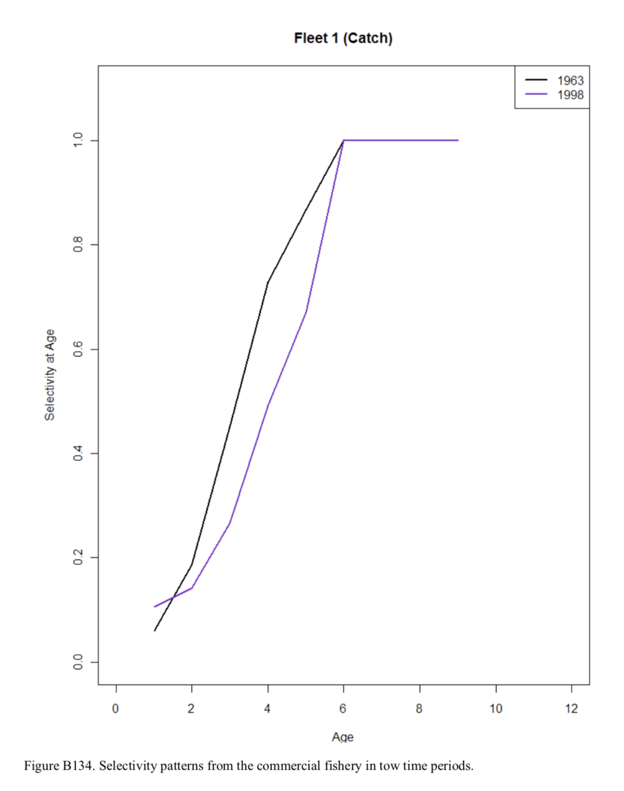

# Growth Curves

__Length/Weight__

The relationship between length and weight for these species is expressed by $W=a*L^b$ 

__Age/Length__

The von Bertalanffy growth curve was used to find the relationship between age and length using K and Linf as argument $Linf*(1-exp(-k*t)$ for the following species.

## Pollock
 
The relationship between Pollock length (cm) and weight (lbs). The data was collected during NEFSC research bottom trawl surveys from 1992 to 1999. For the autumn surveys which were conducted from Cape Hatteras, North Carolina to Nova Scotia, Canada a= 0.000007244 and b= 3.1151 (Wigley et al., 2003). Winter/Spring surveys were conducted from Cape Hatteras, North Carolina to the Southern Flank of George's Bank a= 0.000006788 and b= 3.1024.

```{r pollockweight, echo=FALSE}
source("Weight:Length/LWformula.R") # <- function for Length Weight formula
datafile <-  read.csv(file="Weight:Length/Pollock_SV.csv", header=TRUE, sep=",")
modifiedData <- datafile[,c("INDWT","LENGTH")] # <- only wanted to compare weight (INDWT) and length

#Finding the sample size and removing any incomplete rows (taking out the NAs)
n <- length(modifiedData$INDWT) -sum(is.na(modifiedData$INDWT))

##Pollock
op = par(mfrow=c(1,1))

#Cape Hatteras to Nova Scotia (Autumn)
p_a<- 0.000007244
p_b <- 3.1151
p_L <- 0:130

#Cape Hatteras, NC to southern flank of George's Bank (Winter/Spring)
p_a2<- 0.000006788
p_b2 <- 3.1024
p_L2 <- 0:130

#Inserting the variables into the formula
CH2NSAutumn <- LWformula(a=p_a,b=p_b,L=p_L)
CH2GBWinterSpring <- LWformula(a=p_a2,b=p_b2,L=p_L2)
#Plotting
  #Autumn

plot(CH2NSAutumn,type="l", xlab= "Length (cm)",
     ylab= "Weight (lbs)", col=c("red"))
  #Winter/spring
lines(CH2GBWinterSpring, col=c("blue"))
  #Survey Data
points(modifiedData$LENGTH,modifiedData$INDWT*2.2046)
title(main="Pollock (L_nf=130cm)")
legend(0,60, legend=c("Cape Hatteras, NC to Nova Scotia (Autumn)", "Cape Hatteras, NC to southern flank of George's Bank (Winter/Spring)", 
                      paste("Survey Data (n=",n,")")), col=c("red", "blue", "black"), lty= c(1,1,NA), pch=c(NA,NA,1), cex=0.8)
```

The relationship between Pollock age (yrs) and length (cm) calculated by the von Bertalanffy growth rate for Nova Scotia, Canada where K= 0.1 and in the Northwest Atlantic, Canada where K= 0.17 (Erzini, 1991). These growth rates are compared to commercial fishing data gathered from 1976 to 2018 as well as survey data gathered by NEFSC.


```{r pollockage, echo=FALSE}
source("Growth/growth_curve_function.R") # <- created a function to calculate Von Bertanalanfy growth curve using K and Linf as arguments on another sheet
#Importing data from Commerical Fisheries (CF)
datafile <-  read.csv(file="Growth/pollockData_CF.csv", header=TRUE, sep=",")
modifiedData <- datafile[,c("AGE","LENGTH")]
datafileSV <- read.csv(file="Growth/pollockData_SV.csv", header=TRUE, sep=",")
modifiedSV <- datafileSV[,c("AGE", "LENGTH")]

#Sample size of survey and commercial fisheries data
nSV <- length(modifiedSV$AGE) -sum(is.na(modifiedSV$AGE))
nCF <- length(modifiedData$AGE) - sum(is.na(modifiedData$AGE))

## Pollock
  #Option1
p_Linf <- 130
p_K1 <- 0.17
p_K2 <- 0.1
p_t <- 0:30
Lengthof_p1 <- p_Linf*(1-exp(-p_K1*p_t))
Lengthof_p2 <- p_Linf*(1-exp(-p_K2*p_t))
  #Option2
Lengthof_p1 <- growthCurve(t= 0:30, k= 0.17, Linf= 130)
Lengthof_p2 <- growthCurve(t= 0:30, k= 0.1, Linf= 130)

##Plotting the Growth curve
plot(0:30,Lengthof_p1,type="l", xlab= "Age (years)", ylab= "Length (cm)", col=c("red"))
lines(p_t, Lengthof_p2, type= "l", col=c("blue"))
  #Plotting CFData
points(modifiedData$AGE,modifiedData$LENGTH)
  #Plotting Survey Data
points(modifiedSV$AGE,modifiedSV$LENGTH, pch=0)
title(main="Pollock (L_nf=130cm)")
legend(11,40, legend=c("Nova Scotia, CA (K=0.1)", "Northwest Atlantic, CA (K=0.17)",
                       paste("Commercial Fishing Data (1976-2018, n=",nCF,")"),
                       paste("Survey Data (n=",nSV,")")),col=c("red", "blue", "black", "black"),
                             lty= c(1,1, NA, NA), pch= c(NA, NA, 1, 0), cex=0.8)
```

The relationship between red hake length (cm) and weight (lbs). The data was collected during NEFSC research bottom trawl surveys from 1992 to 1999. For the autumn surveys which were conducted from Cape Hatteras, North Carolina to Nova Scotia, Canada a= 0.000005976951 and b=3.0162 (Wigley et al., 2003). Winter and spring surveys were conducted from Cape Hatteras, North Carolina to the Southern Flank of George's Bank. For the winter surveys a= 0.000006788 and b= 3.1024. For the spring surveys a= 0.000004225 and b= 3.0979.


## Red Hake

```{r redhake, echo=FALSE}
##RedHake
source("Weight:Length/LWformula.R")
datafile <-  read.csv(file="Weight:Length/redhake_SV.csv", header=TRUE, sep=",")
modifiedData <- datafile[,c("INDWT","LENGTH")]

#sample size
n <- length(modifiedData$INDWT) -sum(is.na(modifiedData$INDWT))

op = par(mfrow=c(1,1))

#Cape Hatteras to Nova Scotia (Autumn)
p_a<- 0.000005976951
p_b <- 3.0162
p_L <- 0:66
#CH to GB (winter)
p_a2<- 0.000004737
p_b2 <- 3.0661
p_L2 <- 0:66
#CH to GB (spring)
p_a3<- 0.000004225
p_b3 <- 3.0979
p_L3 <- 0:66

#LWformula(a=p_a,b=p_b,L=p_L)
CH2NSAutumn <- LWformula(a=p_a,b=p_b,L=p_L)
CH2GBWinter <- LWformula(a=p_a2,b=p_b2,L=p_L2)
CH2GBSpring <- LWformula(a=p_a3,b=p_b3,L=p_L3)

plot(CH2NSAutumn,type="l", xlab= "Length (cm)", ylab= "Weight (lbs)", col=c("red"))
lines(CH2GBWinter, col=c("blue"))
lines(CH2GBSpring, col=c("green"))
#Survey data
points(modifiedData$LENGTH,modifiedData$INDWT*2.2046)

title(main="Red Hake (L_nf=66cm)")
legend(0,4.1, legend=c("Cape Hatteras, NC to Nova Scotia (Autumn)", "Cape Hatteras, NC to southern flank of George's Bank (Winter)", "Cape Hatteras, NC to southern flank of George's Bank (Spring)", 
                      paste("Survey Data (n=",n,")")), col=c("red", "blue", "green", "black"), lty= c(1,1,1,NA), pch=c(NA,NA,NA,1), cex=0.8)
```

The relationship between red hake age (years) and length (cm) calculated by the von Bertalanffy growth rate for the North West Atlantic where K= 0.19 (Erzini, 1991). These growth rates are compared to survey data gathered by NEFSC.

```{r redhakeage, echo=FALSE}
##REDHAKE
source("Growth/growth_curve_function.R")
datafile <-  read.csv(file="Growth/redhake_SV.csv", header=TRUE, sep=",")
modifiedData <- datafile[,c("AGE","LENGTH")]

#sample size
n <- length(modifiedData$AGE) -sum(is.na(modifiedData$AGE))

rh_Linf <- 66
rh_K1 <- 0.19
rh_t <- 0:30
#Lengthof_rh1 <- rh_Linf*(1-exp(-rh_K1*rh_t))
Lengthof_rh1 <- growthCurve(t= 0:30, k= 0.19, Linf= 66)
rh_pointst <- c(1,2,3)
rh_pointsl <- c(8,13,16)

#north west atlantic
plot(rh_t,Lengthof_rh1, type="l", xlab= "Age (years)", ylab= "Length (cm)",col=c("red"))
#survey data
points(modifiedData$AGE, modifiedData$LENGTH)

title(main="Red Hake (L_inf= 66cm)")
legend(17,20, legend=c("North West Atlantic, US (K=0.19)",
                       paste("Survey Data (n=",n,")")),col=c("red", "black"),
       lty=c(1,NA),pch= c(NA, 1), cex=0.8)
```

## White Hake

The relationship between white hake length (cm) and weight (lbs). The data was collected during NEFSC research bottom trawl surveys from 1992 to 1999. For the autumn surveys which were conducted from Cape Hatteras, North Carolina to Nova Scotia, Canada a= 0.000004119 and b=3.1715 (Wigley et al., 2003). Winter and spring surveys were conducted from Cape Hatteras, North Carolina to the Southern Flank of George's Bank. For the winter surveys a= 0.000001904 and b= 3.3669. For the spring surveys a= 0.000002376 and b= 3.2903.

```{r whitehake, echo=FALSE}
source("Weight:Length/LWformula.R")
datafile <-  read.csv(file="Weight:Length/whitehake_SV.csv", header=TRUE, sep=",")
modifiedData <- datafile[,c("INDWT","LENGTH")]

#Sample size
n <- length(modifiedData$INDWT) -sum(is.na(modifiedData$INDWT))

## White Hake
op = par(mfrow=c(1,1))

#Cape Hatteras to Nova Scotia (Autumn)
p_a<- 0.000004119
p_b <- 3.1715
p_L <- 0:133

#Winter
p_a2<- 0.000001904
p_b2 <- 3.3669
p_L2 <- 0:133

#Spring
p_a3<- 0.000002376
p_b3 <- 3.2903
p_L3 <- 0:133
#LWformula(a=p_a,b=p_b,L=p_L)
CH2NSAutumn <- LWformula(a=p_a,b=p_b,L=p_L)
CH2GBWinter <- LWformula(a=p_a2,b=p_b2,L=p_L2)
CH2GBSpring <- LWformula(a=p_a3,b=p_b3,L=p_L3)

plot(CH2NSAutumn,type="l", xlab= "Length (cm)", ylab= "Weight (lbs)", col=c("red"))
lines(CH2GBWinter, col=c("blue"))
lines(CH2GBSpring, col=c("green"))
#Survey data
points(modifiedData$LENGTH,modifiedData$INDWT*2.2046)

title(main="White Hake (L_nf= 133cm)")
legend(0,50, legend=c("Cape Hatteras, NC to Nova Scotia (Autumn)", "Cape Hatteras, NC to southern flank of George's Bank (Winter)", "Cape Hatteras, NC to southern flank of George's Bank (Spring)", 
                     paste("Survey Data (n=",n,")")), col=c("red", "blue", "green", "black"), lty= c(1,1,1,NA), pch=c(NA,NA,NA,1), cex=0.8)
source("Growth/growth_curve_function.R")
#datafile <-  read.csv(file="whitehake_SV.csv", header=TRUE, sep=",")
modifiedData <- datafile[,c("AGE","LENGTH")]

#Calculating sample size
n <- length(modifiedData$AGE) -sum(is.na(modifiedData$AGE))
```

The relationship between white hake length and age calculated by the von Bertalanffy growth rate in two instances for the Southern Gulf of St. Lawrence in Canada where in one instance K= 0.218 and in the other K=0.106 (Clay D. & H. Clay, 1991). These growth rates are compared to survey data gathered by NEFSC.

```{r whitehakeage, echo=FALSE}
##white hake
  #Option1
wh_Linf <- 135 #<-Length
wh_K1 <- 0.218 # <- study 1
wh_K2 <- 0.106 # <- study 2
wh_t <- 0:30 # <- Time
Lengthof_wh1 <- wh_Linf*(1-exp(-wh_K1*wh_t))
Lengthof_wh2 <- wh_Linf*(1-exp(-wh_K2*wh_t))
  #Option2
    #Study1
Lengthof_wh1 <- growthCurve(t= 0:30, k= 0.218, Linf= 133)
    #Study2
Lengthof_wh2 <- growthCurve(t= 0:30, k= 0.106, Linf= 133)

##white hake growth curve
  #Study1
plot(wh_t,Lengthof_wh1,type="l", xlab= "Age (years)", ylab= "Length (cm)",col=c("red"))
  #Study2
points(wh_t,Lengthof_wh2, type="l", xlab= "Age (years)", ylab= "Length (cm)",col=c( "blue"))

#Plotting survey data
points(modifiedData$AGE, modifiedData$LENGTH)

title(main="White Hake (L_inf= 133cm)")
legend(10,30, legend=c("Southern Gulf of St. Lawrence, CA Study 1 (K= 0.218)", "Southern Gulf of St. Lawrence, CA Study 2 (K=0.106)",
                       paste("Survey Data (n=",n,")")),col=c("red", "blue", "black"), lty= c(1, 1, NA), pch= c(NA, NA, 1), cex=0.8)
```

# Distribution of Lengths

```{r lengths, echo=FALSE}
datafile <-  read.csv(file="FoodHabits/foodHabits.csv", header=TRUE, sep=",")

modifieddata <- datafile[,c("svspp", "pdlen")]

for (i in c(75,76,77)){
  filt_data  <- modifieddata[modifieddata$svspp == i,]
    if(i==75){
      title <- "Pollock (L_nf=130cm)"
    }else if (i==76){
        title <- "White Hake (L_nf= 133cm)" 
      }else if (i==77) {
        title <- "Red Hake (L_inf= 66cm)"
      }
  hist(filt_data$pdlen, main = title, xlab="Length (cm)", cex.axis=0.8)
}
```

# Stomach Content Volume

```{r stomachs, echo=FALSE, message=FALSE}
datafile <-  read.csv(file="FoodHabits/foodHabits.csv", header=TRUE, sep=",")
modifieddata <- datafile[,c("svspp", "pdlen", "pdswgt")]
library(dplyr)
for (i in c(75,76,77)){
  
  filt_data  <- modifieddata[modifieddata$svspp == i,]
  stomach <- filt_data %>% mutate(interval = cut(pdlen, breaks=10*(0:130), labels= NULL)) %>% 
    group_by(interval) %>%
    summarise(result=mean(pdswgt,na.rm=T))
  if(i==75){
    title <- "Pollock (L_nf=130cm)"
  }else if (i==76){
    title <- "White Hake (L_nf= 133cm)"
  }else if (i==77) {
    title <- "Red Hake (L_inf= 66cm)"
  }
  
  if(i==75){
    names.arg=c( "0-10", "10-20", "20-30", "30-40", "40-50", "50-60",
                 "60-70", "70-80", "80-90", "90-100", "100-110", "110-120")
    }else if(i==76){
      names.arg=c( "0-10", "10-20", "20-30", "30-40", "40-50", "50-60",
                   "60-70", "70-80", "80-90", "90-100", "100-110", "110-120", "120-130","130-140")
  }else if(i==77){
    names.arg=c( "0-10", "10-20", "20-30", "30-40", "40-50", "50-60","60-70","70-80","80-90")
  }
  barplot(stomach$result, main = title, xlab="Length (cm)", ylab="Mean Stomach Content Volume (g)" , names.arg = names.arg, cex.names=0.5)
}
```

# Stock Assessment Reports

## Commercial Landings

### Pollock
The total commercial catch of Pollock from the Gulf of Maine (Area 5) and George's Bank (Area 6) (Northeast Fisheries Science Center, 2010).

```{r pollockCL, echo=FALSE, message=FALSE}
library("readxl")
datafilePCL <-  read_excel("~/Documents/NOAA/Stock Assessment/pollock.xlsx", sheet= 1, skip=1) 


b <- barplot(datafilePCL$us_landings, main = "Pollock Total Commercial Landings", 
        axisnames=TRUE, xlab="Year", ylab= "Total Landings (mt)", names.arg= "", cex.axis= 1)
my_vector <- 1960:2009
text(b[,1], -300, srt = 60, adj= 1, xpd = TRUE, labels = my_vector , cex=0.5)
```

### White Hake

US commercial landings (mt,calc. live) of White Hake in NAFO Subareas 5 and 6, and 464 and 465 (Northeast Fisheries Science Center, 2013)

```{r whitehakeCL , echo=FALSE, message=FALSE}
library("readxl")
datafileWHCL <-  read_excel("~/Documents/NOAA/Stock Assessment/Whitehake.xlsx", sheet= 1, skip=1) 


b <- barplot(datafileWHCL$Total, main = "Whitehake Commercial Landings", 
             axisnames=TRUE, xlab="Year", ylab= "# of Landings", names.arg= "", cex.axis= 0.8)
my_vector <- 1962:2011
text(b[,1], -100, srt = 60, adj= 1, xpd = TRUE, labels = my_vector, cex=0.5)
```

#### *Commercial Landings by Gear Type*

```{r whitehakeCLgeartype , echo=FALSE, message=FALSE}
library("readxl")
datafileLT <-  read_excel("~/Documents/NOAA/Stock Assessment/Whitehake.xlsx", sheet= 1, skip=1) 

b <- barplot(as.numeric(datafileLT$Line_Trawl), main = "Line Trawl Landings", 
             axisnames=TRUE, xlab="Year", ylab= "Total Biomass (mt)", names.arg= "", cex.axis= 0.8)
my_vector <- 1962:2011
text(b[,1], -100, srt = 60, adj= 1, xpd = TRUE, labels = my_vector , cex=0.6)

library("readxl")
datafileBOT <-  read_excel("~/Documents/NOAA/Stock Assessment/Whitehake.xlsx", sheet= 1, skip=1) 

b <- barplot(as.numeric(datafileBOT$Bottom_Otter_Trawl), main = "Bottom Otter Trawl Landings", 
             axisnames=TRUE, xlab="Year", ylab= "Total Biomass (mt)", names.arg= "", cex.axis= 0.8)
my_vector <- 1962:2011
text(b[,1], -100, srt = 60, adj= 1, xpd = TRUE, labels = my_vector , cex=0.6)

library("readxl")
datafileSGN <-  read_excel("~/Documents/NOAA/Stock Assessment/Whitehake.xlsx", sheet= 1, skip=1) 

b <- barplot(as.numeric(datafileSGN$Sink_Gill_Net), main = "Sink Gill Net Landings", 
             axisnames=TRUE, xlab="Year", ylab= "Total Biomass (mt)", names.arg= "", cex.axis= 0.8)
my_vector <- 1962:2011
text(b[,1], -75, srt = 60, adj= 1, xpd = TRUE, labels = my_vector , cex=0.6)

library("readxl")
datafileO <-  read_excel("~/Documents/NOAA/Stock Assessment/Whitehake.xlsx", sheet= 1, skip=1) 

b <- barplot(as.numeric(datafileO$Other), main = "Other  Landings", 
             axisnames=TRUE, xlab="Year", ylab= "Total Biomass (mt)", names.arg= "", cex.axis= 0.8)
my_vector <- 1962:2011
text(b[,1], -3, srt = 60, adj= 1, xpd = TRUE, labels = my_vector , cex=0.6)
```

## Red Hake
US landings of red hake (mt) from the Gulf of Maine to Northern George's Bank (northern region) and Southern George's Bank to Mid-Atlantic Bight (southern region) (Northeast Fisheries Science Center, 2011).

```{r redhakeCL , echo=FALSE, message=FALSE}
library("readxl")
datafileRHCLN <-  read_excel("~/Documents/NOAA/Stock Assessment/Redhake.xlsx", sheet= 1, skip=1) 


b <- barplot(datafileRHCLN$Northern_Total, main = "Total Commercial Landings (North)", 
             axisnames=TRUE, xlab="Year", ylab= "Total Biomass (mt)", names.arg= "", cex.axis= 0.8)
my_vector <- 1964:2009
text(b[,1], -20, srt = 60, adj= 1, xpd = TRUE, labels = my_vector, cex=0.5)

library("readxl")
datafileRHCLS <-  read_excel("~/Documents/NOAA/Stock Assessment/Redhake.xlsx", sheet= 1, skip=1) 


b <- barplot(datafileRHCLS$Southern_Total, main = "Total Commercial Landings (South)", 
             axisnames=TRUE, xlab="Year", ylab= "Total Biomass (mt)", names.arg= "", cex.axis= 0.7)
my_vector <- 1964:2009
text(b[,1], -500, srt = 60, adj= 1, xpd = TRUE, labels = my_vector, cex=0.5)
```

#### *Commercial Landings by Gear Type*

```{r redhakeCLGT , echo=FALSE, message=FALSE}
library("readxl")
options(warn=-1)
datafileLLN <-  read_excel("~/Documents/NOAA/Stock Assessment/Redhake.xlsx", sheet= 1, skip=1) 

b <- barplot(as.numeric(datafileLLN$LL_N), main = "Longline Landings (North)", 
             axisnames=TRUE, xlab="Year", ylab= "Total Biomass (mt)", names.arg= "", cex.axis= 0.8)
my_vector <- 1964:2009
text(b[,1], -2, srt = 60, adj= 1, xpd = TRUE, labels = my_vector , cex=0.6)

library("readxl")
datafileLLS <-  read_excel("~/Documents/NOAA/Stock Assessment/Redhake.xlsx", sheet= 1, skip=1) 

b <- barplot(as.numeric(datafileLLS$LL_S), main = "Longline Landings (South)", 
             axisnames=TRUE, xlab="Year", ylab= "Total Biomass (mt)", names.arg= "", cex.axis= 0.8)
my_vector <- 1964:2009
text(b[,1], -0.5, srt = 60, adj= 1, xpd = TRUE, labels = my_vector , cex=0.6)

library("readxl")
datafileOTFN <-  read_excel("~/Documents/NOAA/Stock Assessment/Redhake.xlsx", sheet= 1, skip=1) 

b <- barplot(as.numeric(datafileOTFN$OTF_N), main = "Otter Trawl Landings (North)", 
             axisnames=TRUE, xlab="Year", ylab= "Total Biomass (mt)", names.arg= "", cex.axis= 0.8)
my_vector <- 1964:2009
text(b[,1], -50, srt = 60, adj= 1, xpd = TRUE, labels = my_vector , cex=0.6)

library("readxl")
datafileOTFS <-  read_excel("~/Documents/NOAA/Stock Assessment/Redhake.xlsx", sheet= 1, skip=1) 

b <- barplot(as.numeric(datafileOTFS$OTF_S), main = "Otter Trawl Landings (South)", 
             axisnames=TRUE, xlab="Year", ylab= "Total Biomass (mt)", names.arg= "", cex.axis= 0.8)
my_vector <- 1964:2009
text(b[,1], -500, srt = 60, adj= 1, xpd = TRUE, labels = my_vector , cex=0.6)

library("readxl")
datafileOTSN <-  read_excel("~/Documents/NOAA/Stock Assessment/Redhake.xlsx", sheet= 1, skip=1) 

b <- barplot(as.numeric(datafileOTSN$OTS_N), main = "Otter Trawl Shrimp Landings (North)", 
             axisnames=TRUE, xlab="Year", ylab= "Total Biomass (mt)", names.arg= "", cex.axis= 0.8)
my_vector <- 1964:2009
text(b[,1], -5, srt = 60, adj= 1, xpd = TRUE, labels = my_vector , cex=0.6)

library("readxl")
datafileSGNN <-  read_excel("~/Documents/NOAA/Stock Assessment/Redhake.xlsx", sheet= 1, skip=1) 

b <- barplot(as.numeric(datafileSGNN$SGN_N), main = "Sink Gill Net Landings (North)", 
             axisnames=TRUE, xlab="Year", ylab= "Total Biomass (mt)", names.arg= "", cex.axis= 0.8)
my_vector <- 1964:2009
text(b[,1], -3, srt = 60, adj= 1, xpd = TRUE, labels = my_vector , cex=0.6)

library("readxl")
datafileSGNS <-  read_excel("~/Documents/NOAA/Stock Assessment/Redhake.xlsx", sheet= 1, skip=1) 

b <- barplot(as.numeric(datafileSGNS$SGN_S), main = "Sink Gill Net Landings (South)", 
             axisnames=TRUE, xlab="Year", ylab= "Total Biomass (mt)", names.arg= "", cex.axis= 0.8)
my_vector <- 1964:2009
text(b[,1], -0.3, srt = 60, adj= 1, xpd = TRUE, labels = my_vector , cex=0.6)

library("readxl")
datafileOTHN <-  read_excel("~/Documents/NOAA/Stock Assessment/Redhake.xlsx", sheet= 1, skip=1) 

b <- barplot(as.numeric(datafileOTHN$OTH_N), main = "Dredge Landings (North)", 
             axisnames=TRUE, xlab="Year", ylab= "Total Biomass (mt)", names.arg= "", cex.axis= 0.8)
my_vector <- 1964:2009
text(b[,1], -0.4, srt = 60, adj= 1, xpd = TRUE, labels = my_vector , cex=0.6)

library("readxl")
datafileOTHS <-  read_excel("~/Documents/NOAA/Stock Assessment/Redhake.xlsx", sheet= 1, skip=1) 

b <- barplot(as.numeric(datafileOTHS$OTH_N), main = "Dredge Landings (South)", 
             axisnames=TRUE, xlab="Year", ylab= "Total Biomass (mt)", names.arg= "", cex.axis= 0.8)
my_vector <- 1964:2009
text(b[,1], -0.4, srt = 60, adj= 1, xpd = TRUE, labels = my_vector , cex=0.6)
```


## *Biomass*

### Pollock

The estimated biomass of Pollock for NAFO sub areas 5 (Gulf of Maine) & 6 (George's Bank) including a portion of Eastern George's Bank (subdivision 5Zc) (Northeast Fisheries Science Center, 2010).

```{r pollockBM, echo=FALSE, message=FALSE}
library("readxl")
datafilePBM <-  read_excel("~/Documents/NOAA/Stock Assessment/pollock.xlsx", sheet= 2, skip=1) 


b <- barplot(datafilePBM$Total, main = "Pollock Total Biomass", 
             axisnames=TRUE, xlab="Year", ylab= "Total Biomass (mt)", names.arg= "", cex.axis= 0.8)
my_vector <- 1970:2009
text(b[,1], -8000, srt = 60, adj= 1, xpd = TRUE, labels = my_vector , cex=0.5)
```

### White Hake

Stratified mean catch per tow in numbers and weight (kg) for White Hake from NEFSC offshore fall spring and fall research vessel bottom trawl surveys (strata 21-30,36-40) (Northeast Fisheries Science Center, 2013).
 
```{r whitehakeBM , echo=FALSE, message=FALSE}
library("readxl")
datafilespring <-  read_excel("~/Documents/NOAA/Stock Assessment/Whitehake.xlsx", sheet= 3, skip=3) 


b <- barplot(datafilespring$Mean, main = "White Hake Biomass (Spring)", 
             axisnames=TRUE, xlab="Year", ylab= "Mean biomass per tow (kg)", names.arg= "", cex.axis= 0.8)
my_vector <- 1968:2012
text(b[,1], -1, srt = 60, adj= 1, xpd = TRUE, labels = my_vector , cex=0.5)


datafilefall <-  read_excel("~/Documents/NOAA/Stock Assessment/Whitehake.xlsx", sheet= 4, skip=3) 


b <- barplot(datafilefall$Mean, main = "White Hake Biomass (Fall)", 
             axisnames=TRUE, xlab="Year", ylab= "Mean biomass per tow (kg)", names.arg= "", cex.axis= 0.8)
my_vector <- 1963:2012
text(b[,1], -0.5, srt = 60, adj= 1, xpd = TRUE, labels = my_vector , cex=0.5)
```
### Red Hake
Swept area biomass red hake from the NEFSC fall and spring bottom trawl surveys in the northern and southern management regions combined (strata 1- 30, 36-40, 61-76). Estimates for 2009 were converted to Albatross units using the calibration factors at length in Table C34 (Northeast Fisheries Science Center, 2011).

```{r redhakeBM , echo=FALSE, message=FALSE}
library("readxl")
datafileRHBMF <-  read_excel("~/Documents/NOAA/Stock Assessment/Redhake.xlsx", sheet= 4, skip=1) 


b <- barplot(datafileRHBMF$Swept_Area_Biomass, main = "Red Hake Biomass (Fall)", 
             axisnames=TRUE, xlab="Year", ylab= "Total Biomass (mt)", names.arg= "", cex.axis= 0.8)
my_vector <- 1967:2009
text(b[,1], -500, srt = 60, adj= 1, xpd = TRUE, labels = my_vector , cex=0.5)

library("readxl")
datafileRHBMS <-  read_excel("~/Documents/NOAA/Stock Assessment/Redhake.xlsx", sheet= 5, skip=2) 


b <- barplot(datafileRHBMS$Swept_Area, main = "Red Hake Biomass (Spring)", 
             axisnames=TRUE, xlab="Year", ylab= "Total Biomass (mt)", names.arg= "", cex.axis= 0.8)
my_vector <- 1968:2010
text(b[,1], -500, srt = 60, adj= 1, xpd = TRUE, labels = my_vector , cex=0.5)
```


## *Discards*
 White Hake discards (mt) from the northern and southern regions by gear. The discards from 1981-1988 (1991 for scallop dredge and longline) are hind- cast using the first three years of available data. The otter trawl discards are hind-cast combining mesh-sizes (Northeast Fisheries Science Center, 2013).
 
```{r whitehakeD , echo=FALSE, message=FALSE}
library("readxl")
datafileLLN <-  read_excel("~/Documents/NOAA/Stock Assessment/Whitehake.xlsx", sheet= 2, skip=2) 

b <- barplot(datafileLLN$LLTotal, main = "Longline Discards (North)", 
             axisnames=TRUE, xlab="Year", ylab= "Total Biomass (mt)", names.arg= "", cex.axis= 0.8)
my_vector <- 1981:2009
text(b[,1], -1, srt = 60, adj= 1, xpd = TRUE, labels = my_vector , cex=0.8)

library("readxl")
datafileLLS <-  read_excel("~/Documents/NOAA/Stock Assessment/Whitehake.xlsx", sheet= 5, skip=2) 

b <- barplot(datafileLLS$LLTotal, main = "Longline Discards (South)", 
             axisnames=TRUE, xlab="Year", ylab= "Total Biomass (mt)", names.arg= "", cex.axis= 0.8)
my_vector <- 1981:2009
text(b[,1], -0.05, srt = 60, adj= 1, xpd = TRUE, labels = my_vector , cex=0.8)

library("readxl")
datafileLMN <-  read_excel("~/Documents/NOAA/Stock Assessment/Whitehake.xlsx", sheet= 2, skip=2) 

b <- barplot(datafileLMN$LMTotal, main = " Large Mesh Otter Trawl Discards (North)", 
             axisnames=TRUE, xlab="Year", ylab= "Total Biomass (mt)", names.arg= "", cex.axis= 0.8)
my_vector <- 1981:2009
text(b[,1], -30, srt = 60, adj= 1, xpd = TRUE, labels = my_vector , cex=0.8)


library("readxl")
datafileLMS <-  read_excel("~/Documents/NOAA/Stock Assessment/Whitehake.xlsx", sheet= 5, skip=2) 


b <- barplot(datafileLMS$LMTotal, main = "Large Mesh Otter Trawl Discards (South)", 
             axisnames=TRUE, xlab="Year", ylab= "Total Biomass (mt)", names.arg= "", cex.axis= 0.8)
my_vector <- 1981:2009
text(b[,1], -100, srt = 60, adj= 1, xpd = TRUE, labels = my_vector , cex=0.8)


library("readxl")
datafileSMN <-  read_excel("~/Documents/NOAA/Stock Assessment/Whitehake.xlsx", sheet= 2, skip=10) 


b <- barplot(datafileSMN$SMTotal, main = " Small Mesh Otter Trawl Discards (North)", 
             axisnames=TRUE, xlab="Year", ylab= "Total Biomass (mt)", names.arg= "", cex.axis= 0.8)
my_vector <- 1989:2009
text(b[,1], -15, srt = 60, adj= 1, xpd = TRUE, labels = my_vector , cex=0.8)

library("readxl")
datafileSMS <-  read_excel("~/Documents/NOAA/Stock Assessment/Whitehake.xlsx", sheet= 5, skip=10) 


b <- barplot(datafileSMS$SMTotal, main = "Small Mesh Otter Trawl Discards (South)", 
             axisnames=TRUE, xlab="Year", ylab= "Total Biomass (mt)", names.arg= "", cex.axis= 0.8)
my_vector <- 1989:2009
text(b[,1], -15, srt = 60, adj= 1, xpd = TRUE, labels = my_vector , cex=0.8)


library("readxl")
datafileSGN <-  read_excel("~/Documents/NOAA/Stock Assessment/Whitehake.xlsx", sheet= 2, skip=2)

b <- barplot(datafileSGN$SGTotal, main = "Sink Gill Net Discards (North)",
             axisnames=TRUE, xlab="Year", ylab= "Total Biomass (mt)", names.arg= "", cex.axis= 0.8)
my_vector <- 1981:2009
text(b[,1], -10, srt = 60, adj= 1, xpd = TRUE, labels = my_vector , cex=0.8)

library("readxl")
datafileSGS <-  read_excel("~/Documents/NOAA/Stock Assessment/WHitehake.xlsx", sheet= 5, skip=2)


b <- barplot(datafileSGS$SGTotal, main = "Sink Gill Net Discards (South)",
             axisnames=TRUE, xlab="Year", ylab= "Total Biomass (mt)", names.arg= "", cex.axis= 0.8)
my_vector <- 1981:2009
text(b[,1], -0.1, srt = 60, adj= 1, xpd = TRUE, labels = my_vector , cex=0.8)

library("readxl")
datafileSDN <-  read_excel("~/Documents/NOAA/Stock Assessment/Whitehake.xlsx", sheet= 2, skip=2)


b <- barplot(datafileSDN$ScallopTotal, main = "Scallop Dredge Discards (North)",
             axisnames=TRUE, xlab="Year", ylab= "Total Biomass (mt)", names.arg= "", cex.axis= 0.8)
my_vector <- 1981:2009
text(b[,1], -3, srt = 60, adj= 1, xpd = TRUE, labels = my_vector , cex=0.8)

library("readxl")
datafileSDS <-  read_excel("~/Documents/NOAA/Stock Assessment/Whitehake.xlsx", sheet= 5, skip=2)


b <- barplot(datafileSDS$ScallopTotal, main = "Scallop Dredge Discards (South)",
             axisnames=TRUE, xlab="Year", ylab= "Total Biomass (mt)", names.arg= "", cex.axis= 0.8)
my_vector <- 1981:2009
text(b[,1], -5, srt = 60, adj= 1, xpd = TRUE, labels = my_vector , cex=0.8)

library("readxl")
datafileST <-  read_excel("~/Documents/NOAA/Stock Assessment/Whitehake.xlsx", sheet= 2, skip=2)


b <- barplot(datafileST$ShrimpTotal, main = "Shrimp Trawl Discards (North)",
             axisnames=TRUE, xlab="Year", ylab= "Total Biomass (mt)", names.arg= "", cex.axis= 0.8)
my_vector <- 1981:2009
text(b[,1], -2, srt = 60, adj= 1, xpd = TRUE, labels = my_vector , cex=0.8)
```


### *Discards*
Red hake discards (mt) from the northern and southern regions by gear. The discards from 1981-1988 (1991 for scallop dredge and longline) are hind-cast using the first three years of available data. The otter trawl discards are hind-cast combining mesh-sizes (Northeast Fisheries Science Center, 2011). 

```{r redhakeD , echo=FALSE, message=FALSE}
library("readxl")
datafileRHLLN <-  read_excel("~/Documents/NOAA/Stock Assessment/Redhake.xlsx", sheet= 2, skip=2) 

b <- barplot(datafileRHLLN$LonglineTotal, main = "Longline Discards (North)", 
             axisnames=TRUE, xlab="Year", ylab= "Total Biomass (mt)", names.arg= "", cex.axis= 0.8)
my_vector <- 1981:2009
text(b[,1], -1, srt = 60, adj= 1, xpd = TRUE, labels = my_vector , cex=0.8)

library("readxl")
datafileRHLLS <-  read_excel("~/Documents/NOAA/Stock Assessment/Redhake.xlsx", sheet= 3, skip=2) 

b <- barplot(datafileRHLLS$LonglineTotal, main = "Longline Discards (South)", 
             axisnames=TRUE, xlab="Year", ylab= "Total Biomass (mt)", names.arg= "", cex.axis= 0.8)
my_vector <- 1981:2009
text(b[,1], -0.2, srt = 60, adj= 1, xpd = TRUE, labels = my_vector , cex=0.8)

library("readxl")
datafileRHLMN <-  read_excel("~/Documents/NOAA/Stock Assessment/Redhake.xlsx", sheet= 2, skip=2) 

b <- barplot(datafileRHLMN$LargemeshTotal, main = "Large Mesh Otter Trawl Discards (North)", 
             axisnames=TRUE, xlab="Year", ylab= "Total Biomass (mt)", names.arg= "", cex.axis= 0.8)
my_vector <- 1981:2009
text(b[,1], -30, srt = 60, adj= 1, xpd = TRUE, labels = my_vector , cex=0.8)


library("readxl")
datafileRHLMS <-  read_excel("~/Documents/NOAA/Stock Assessment/Redhake.xlsx", sheet= 3, skip=2) 


b <- barplot(datafileRHLMS$LargeMeshTotal, main = "Large Mesh Otter Trawl Discards (South)", 
             axisnames=TRUE, xlab="Year", ylab= "Total Biomass (mt)", names.arg= "", cex.axis= 0.8)
my_vector <- 1981:2009
text(b[,1], -100, srt = 60, adj= 1, xpd = TRUE, labels = my_vector , cex=0.8)


library("readxl")
datafileRHSMN <-  read_excel("~/Documents/NOAA/Stock Assessment/Redhake.xlsx", sheet= 2, skip=10) 


b <- barplot(datafileRHSMN$SmallmeshTotal, main = "Small Mesh Otter Trawl Discards (North)", 
             axisnames=TRUE, xlab="Year", ylab= "Total Biomass (mt)", names.arg= "", cex.axis= 0.8)
my_vector <- 1989:2009
text(b[,1], -15, srt = 60, adj= 1, xpd = TRUE, labels = my_vector , cex=0.8)

library("readxl")
datafileRHSMS <-  read_excel("~/Documents/NOAA/Stock Assessment/Redhake.xlsx", sheet= 3, skip=10) 


b <- barplot(datafileRHSMS$SmallMeshTotal, main = "Small Mesh Otter Trawl Discards (South)", 
             axisnames=TRUE, xlab="Year", ylab= "Total Biomass (mt)", names.arg= "", cex.axis= 0.8)
my_vector <- 1989:2009
text(b[,1], -100, srt = 60, adj= 1, xpd = TRUE, labels = my_vector , cex=0.8)

library("readxl")
datafileSGN <-  read_excel("~/Documents/NOAA/Stock Assessment/Redhake.xlsx", sheet= 2, skip=2) 


b <- barplot(datafileSGN$sinkgillTotal, main = "Sink Gill Net Discards (North)", 
             axisnames=TRUE, xlab="Year", ylab= "Total Biomass (mt)", names.arg= "", cex.axis= 0.8)
my_vector <- 1981:2009
text(b[,1], -0.5, srt = 60, adj= 1, xpd = TRUE, labels = my_vector , cex=0.8)

library("readxl")
datafileSGS <-  read_excel("~/Documents/NOAA/Stock Assessment/Redhake.xlsx", sheet= 3, skip=2) 


b <- barplot(datafileSGS$SinkGillTotal, main = "Sink Gill Net Discards (South)", 
             axisnames=TRUE, xlab="Year", ylab= "Total Biomass (mt)", names.arg= "", cex.axis= 0.8)
my_vector <- 1981:2009
text(b[,1], -0.01, srt = 60, adj= 1, xpd = TRUE, labels = my_vector , cex=0.8)


datafileRHSN <-  read_excel("~/Documents/NOAA/Stock Assessment/Redhake.xlsx", sheet= 2, skip=2) 

b <- barplot(datafileRHSN$scallopTotal, main = "Scallop Dredge Discards (North)", 
             axisnames=TRUE, xlab="Year", ylab= "Total Biomass (mt)", names.arg= "", cex.axis= 0.8)
my_vector <- 1981:2009
text(b[,1], -0.5, srt = 60, adj= 1, xpd = TRUE, labels = my_vector , cex=0.8)

library("readxl")
datafileRHSS <-  read_excel("~/Documents/NOAA/Stock Assessment/Redhake.xlsx", sheet= 3, skip=2) 


b <- barplot(datafileRHSS$ScallopTotal, main = "Scallop Dredge Discards (South)", 
             axisnames=TRUE, xlab="Year", ylab= "Total Biomass (mt)", names.arg= "", cex.axis= 0.8)
my_vector <- 1981:2009
text(b[,1], -5, srt = 60, adj= 1, xpd = TRUE, labels = my_vector , cex=0.8)

library("readxl")
datafileRHST <-  read_excel("~/Documents/NOAA/Stock Assessment/Redhake.xlsx", sheet= 2, skip=2) 


b <- barplot(datafileRHST$shrimpTotal, main = "Shrimp Trawl Discards (North)", 
             axisnames=TRUE, xlab="Year", ylab= "Total Biomass (mt)", names.arg= "", cex.axis= 0.8)
my_vector <- 1981:2009
text(b[,1], -10, srt = 60, adj= 1, xpd = TRUE, labels = my_vector , cex=0.8)
```

## Recruitment

### Pollock
 Recruitment was assumed to follow a Beverton-Holt functional form, with an assumed CV=0.5 for annual recruitment deviations (i.e. on log-space the standard deviation of the residuals about the stock-recruitment relationship was 0.5). Mean recruitment was around 21 million age 1 recruits. The model estimated steepness at 0.66 with a CV of 0.24 (Northeast Fisheries Science Center, 2010).
```{r C37, echo=FALSE, out.width = '100%'}

```

### White Hake

See B2.2.6. for Stock-recruitment function residuals (Northeast Fisheries Science Center, 2013).

A Beverton-Holt stock-recruitment relationship with steepness h=0.8, and σR=0.48 as determined from the ASAP time series of recruitments (with only the values from 1982 onwards being used to avoid the negative bias introduced in earlier estimates through smearing of year classes with the use of an average age-length key to provide the survey catches-at-age input to the assessment). Given a recent five year average of biological and selectivity parameters, relative reference points were calculated. Assuming that RMSY corresponded to the average of the full time series of recruitment estimates, the relative reference points were scaled to calculate the pristine mean recruitment (R0). Stochastic projections were then performed to determine SSBMSY and SSB0 (taken as the medians of the projected distributions) (Northeast Fisheries Science Center, 2013).


```{r B1.4, echo=FALSE, out.width = '100%'}

```
Appendix Figure B1.4 compares the stock-recruitment curves for RCp (Ricker), sensitivity 2a (Beverton-Holt) and sensitivity 2b (modified Ricker, with y estimated). See Appendix Table B1.4 Exploration of the SCAA with the final data on page 320 (Northeast Fisheries Science Center, 2013). 


```{r B1.10, echo=FALSE, out.width = '100%'}

```

### Red Hake
Note: No stock recruitment model found for red hake.

## Selectivity

### Pollock
The divergence between the NEFSC fall index selectivity and the fishery selectivity is especially pronounced towards the end of the time series. This divergence is important, as the AIM model assumes that the selectivity is the same in the fishery and the index.
The sensitivity of stock status to the model estimated dome-shaped selectivities was evaluated by comparing current F and SSB estimates from the sensitivity model with flat survey selectivity for ages 6-9 to their corresponding reference points. Assuming flat survey selectivity, the model estimate of SSB2009 was 77,000 mt, which is greater than the SSBMSY proxy of 58,000 mt, so the stock would not be considered overfished. The model estimate of F5-7 in 2009, assuming flat survey selectivity, is 0.13, which is less than the corresponding F40% on ages 5-7 of 0.22, so overfishing is not occurring. It was therefore concluded that stock status is not sensitive to the shape of survey selectivity at older ages (Northeast Fisheries Science Center, 2010).

```{r C64, echo=FALSE, out.width = '100%'}

```

### White Hake

The selectivities estimated from the model indicate that the autumn survey catches more younger fish than the spring while the spring catches more older fish, although both surveys have highly domed selectivities (Northeast Fisheries Science Center, 2013).

```{r B139, echo=FALSE, out.width = '100%'}

```
 
 Fishery selectivities show a higher selectivity at younger ages in the first block (Northeast Fisheries Science Center, 2013).
 ```{r B134, echo=FALSE, out.width = '100%'}

```

### Red Hake

Note: no selectivity indices found
 

# References

## *Pollock*
Erzini, K., 1991. A compilation of data on variability in length-age in marine fishes. Fisheries Stock Assessment, Title XII, Collaborative Research Support Program, University of Rhode Island. Working paper 77, 36p.	

Northeast Fisheries Science Center. 2010. 50th Northeast Regional Stock Assessment Workshop (50th SAW) Assessment Report. US Dept Commer, Northeast Fish Sci Cent Ref Doc. 10-17; 844 p. Available from: National Marine Fisheries Service, 166 Water Street, Woods Hole, MA 02543-1026, or online at http://nefsc.noaa.gov/publications/

Wigley, S. E., McBride, H. M., & McHugh, N. J. (2003). Length-weight relationships for 74 fish species collected during NEFSC research vessel bottom trawl surveys, 1992-99(United States, NOAA, Northeast Fisheries Science Center). Woods Hole, MA: U.S. Dept. of Commerce, National Oceanic and Atmospheric Administration, National Marine Fisheries Service, Northeast Fisheries Science Center.


## *Redhake*
Northeast Fisheries Science Center. 2011. 51st Northeast Regional Stock Assessment Workshop (51st SAW) Assessment Report. US Dept Commer, Northeast Fish Sci Cent Ref Doc. 11-02; 856 p. Available from: National Marine Fisheries Service, 166 Water Street, Woods Hole, MA 02543-1026, or online at http://nefsc.noaa.gov/publications/

## *Whitehake*
Clay, D. and H. Clay, 1991. Determination of age and growth of white hake (Urophycis tenuis Mitchill) from the southern Gulf of St. Lawrence, Canada (including techniques for commercial sampling). Can. Tech. Rep. Fish. Aquat. Sci. 1828. 29 p.

Northeast Fisheries Science Center. 2013. 56th Northeast Regional Stock Assessment Workshop (56th SAW) Assessment Report. US Dept Commer, Northeast Fish Sci Cent Ref Doc. 13-10; 868 p. Available from: National Marine Fisheries Service, 166 Water Street, Woods Hole, MA 02543-1026, or online at http://nefsc.noaa.gov/publications/

Wigley, S. E., McBride, H. M., & McHugh, N. J. (2003). Length-weight relationships for 74 fish species collected during NEFSC research vessel bottom trawl surveys, 1992-99(United States, NOAA, Northeast Fisheries Science Center). Woods Hole, MA: U.S. Dept. of Commerce, National Oceanic and Atmospheric Administration, National Marine Fisheries Service, Northeast Fisheries Science Center.